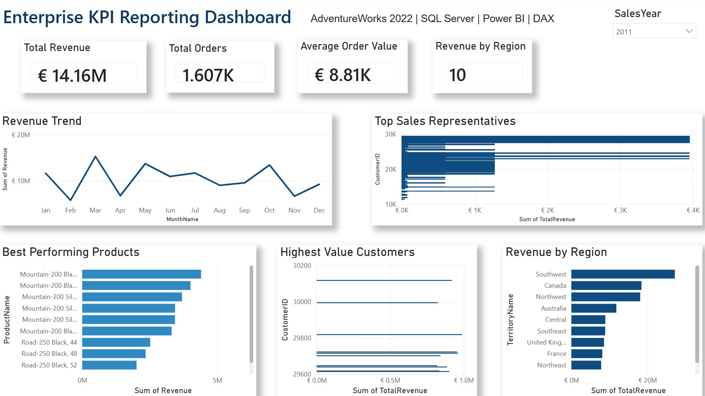
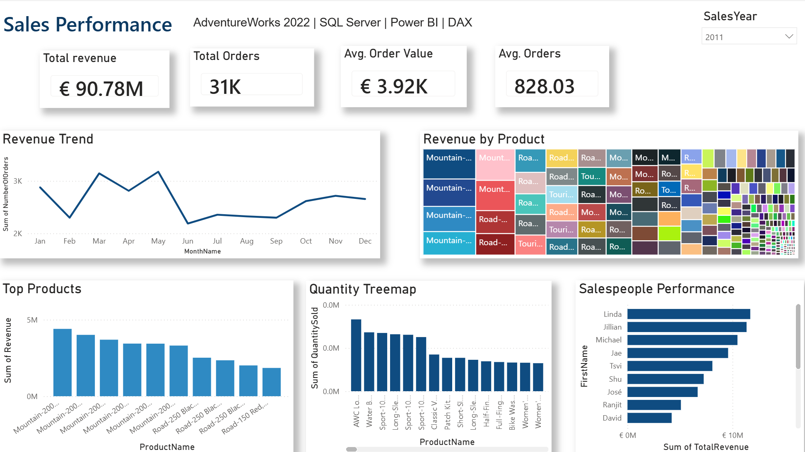
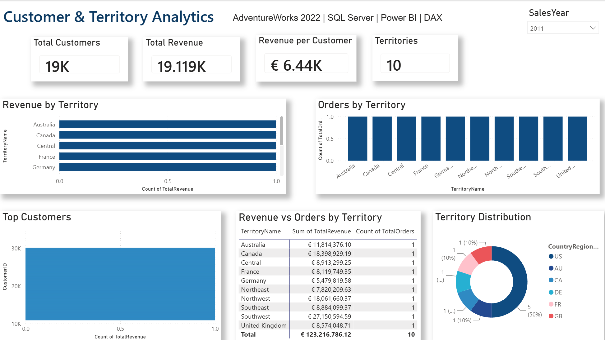

# 📊 Enterprise KPI Reporting Dashboard

Executive KPI reporting solution built using **AdventureWorks 2022**, **SQL Server**, **Power BI** and **DAX**.

The project demonstrates how enterprise sales data can be transformed into interactive dashboards for executive reporting, sales performance monitoring and customer analytics.

---

# Dashboard Preview

## Executive Overview


## Sales Performance


## Customer & Territory Analytics


---

# Business Problem

Management requires one centralized reporting platform to monitor:

- Sales Revenue
- Orders
- Customer Performance
- Product Performance
- Sales Territories
- Executive KPIs

This dashboard provides a single source of truth for business reporting.

---

# Architecture

```
AdventureWorks2022

        │

        ▼

SQL Server

        │

        ▼

SQL Reporting Views

        │

        ▼

Power BI

        │

        ▼

Executive KPI Dashboards
```

---

# Technology Stack

- SQL Server 2022
- Power BI
- DAX
- SQL Views
- Power Query

---

# Reporting Views

- Reporting_vw_MonthlyRevenue
- Reporting_vw_ProductPerformance
- Reporting_vw_TopCustomers
- Reporting_vw_SalespersonPerformance
- Reporting_vw_SalesTerritoryPerformance

---

# Dashboard Pages

## Executive Overview

- Revenue KPIs
- Orders
- Revenue Trend
- Best Products
- Highest Value Customers
- Regional Revenue

---

## Sales Performance

- Orders by Month
- Product Revenue
- Quantity Sold
- Salesperson Performance

---

## Customer & Territory Analytics

- Customer KPIs
- Revenue by Territory
- Orders by Territory
- Top Customers
- Territory Distribution

---

# Features

✔ Executive Reporting

✔ Sales Analytics

✔ Customer Analytics

✔ Territory Analysis

✔ Interactive Filters

✔ DAX Measures

✔ SQL Reporting Views

✔ KPI Dashboards

---

# Project Structure

```
powerbi/
screenshots/
sql/
README.md
```

---

# Future Improvements

- Microsoft Fabric
- Power BI Service Deployment
- Row Level Security
- Automated Refresh

---

# Author

**Shreya Jayani**

Business Intelligence | Power BI | SQL | Data Analytics
